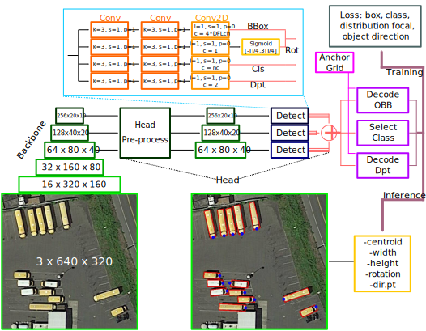
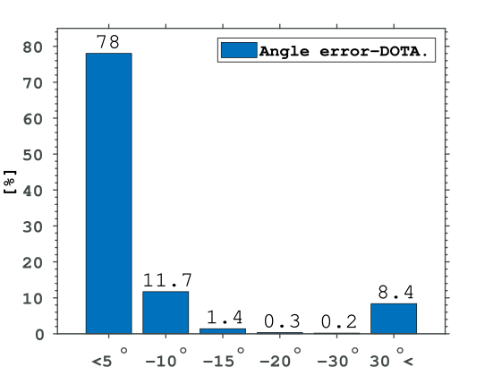
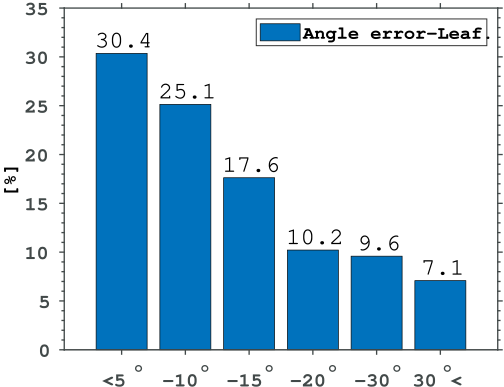
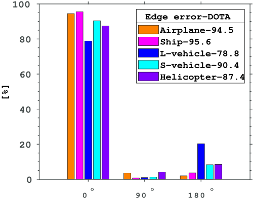

# Directional Bounding Boxes for Oriented Object Detection

## Abstract
Object detection is a fundamental problem with many ap-
plications. The typical solution is to localize detected objects with a
bounding box. However, standard (or horizontal) bounding boxes (BB)
are not ideal in case of crowded scenes, especially for elongated objects.
Hence so-called oriented bounding boxes (OBB) became popular which
will localize objects by a minimal enclosing box. The name oriented refers
to the technique behind, which introduces a rotation angle of a standard
BB for a better enclosing of the detected object. However, this orien-
tation may or may not correspond to the orientation of the detected
object, even for elongated objects – e.g. the front of a plane or a car is
still not detected and even the OBB orientation is rather representing
the perspective distortion than the inherent direction of an object. Thus
true-oriented object detection is still an unsolved problem! Herein, we
propose a novel method (and to the best of our knowledge the first such
method), the Directional Object Bounding Box (DOBB), which is capable
of detecting the object’s own direction together with its minimal enclos-
ing box (OBB). The proposed method is integrated into the popular
YOLO object detector to create a complete directional object detector.
Comparative tests confirm its state-of-the-art performance on the public
aerial dataset DOTA (for man-made objects) and a custom agricultural
vine leaf dataset (for natural objects).

## Note

This repository presents the code to the Directed Oriented Bounding Box (DOBB) detection method. This methoed is based on the [YOLOv8-OBB](https://docs.ultralytics.com/tasks/obb/) method[[1]](#1). See example scripts on how to run in the [examples](examples/) folder. The [YOLOv8-OBB](https://docs.ultralytics.com/tasks/obb/) will ask you to install the ultralytics package, however, since DOBB is currently not part of the ultralytics package, you need to create a new environment with required packages, without installing ultralytics itself. See the [pyproject.toml](ultralytics/blob/main/pyproject.toml) file for the required dependencies. For more information on the setup and the code itself please visit the original [source code](https://github.com/ultralytics/ultralytics)

## Dataset

For the DOTA dataset please refer to the original [Ultralytics page](https://docs.ultralytics.com/datasets/obb/).

The Leaf dataset will be shortly available.

## Evaluation

We evaluate the accuracy of the OBB detection using mAP50, while the accuracy of the direction using angle error, and edge error. 

| Method  | Backbone | PL | SH | LV | SV | HC | Leaf |
| ------------- | ------------- |------------- |------------- |------------- |------------- |------------- |------------- |
CenterNet [[2]](#2) | DLA-34 | 81 | 64.9 | 64 | 38.6 | 57.4 | - |
DRN [[3]](#3) | Hourglass-52 | 89.71 | 85.84 | 74.43 | 76.22 | 58.48 | - |
BBAVect [[4]](#4) | R-101 | 88.63 | 88.06 | 80.4 | 78.26 | 63.96 | - |
S2ANET [[5]](#5) | R-101-FPN | 89.28 | 89.21 | 82.93 | *80.18* | 65.55 | - |
GWD [[6]](#6) | R-152 | 89.66 | 87.7 | 84.83 | 78.91 | 74.92 | - |
G-REP [[7]](#7) | Swin-T | 88.15 | 88.37 | *85.68* | **80.94** | *75.83* | - |
GGHL [[8]](#8) | DarkNet53 | 89.16 | 87.58 | 82.26 | 77.29 | 70.47 | - |  
YOLOv8-OBB [[1]](#1) | CSPDarkNet53 | **96.9** | **92.2** | **86.7** | 69.2 | **78.3** | **80.4** | 
**DOBB** | CSPDarkNet53 | *96.6* | *92.2* | 85.3 | 64.8 | 75.4 | *80.3* |

## References

<a id="1">[1]</a> 
Jocher, G., Chaurasia, A., & Qiu, J. (2023). Ultralytics YOLO (Version 8.0.0) [Computer software]. https://github.com/ultralytics/ultralytics

<a id="2">[2]</a> 
Duan, K., Bai, S., Xie, L., Qi, H., Huang, Q., Tian, Q.: CenterNet: Keypoint Triplets for Object Detection. In: International Conference on Computer Vision. pp. 6568–6577. Seoul, Korea (South) (Oct 2019)

<a id="3">[3]</a> 
an, X., Ren, Y., Sheng, K., Dong, W., Yuan, H., Guo, X., Ma, C., Xu, C.: Dynamic Refinement Network for Oriented and Densely Packed Object Detection. In: Conference on Computer Vision and Pattern Recognition. pp. 11204–11213. Seattle, WA, USA (Jun 2020)

<a id="4">[4]</a> 
Yi, J., Wu, P., Liu, B., Huang, Q., Qu, H., Metaxas, D.N.: Oriented Object Detection in Aerial Images with Box Boundary-Aware Vectors. In: Winter Conference on Applications of Computer Vision. pp. 2149–2158. Waikoloa, HI, USA (Jan 2021)

<a id="5">[5]</a>
Han, J., Ding, J., Li, J., Xia, G.: Align Deep Features for Oriented Object Detection. Transactions on Geoscience and Remote Sensing 60, 1–11 (2022)

<a id="6">[6]</a> 
Yang, X., Zhang, G., Li, W., Zhou, Y., Wang, X., Yan, J.: H2RBox: Horizontal Box Annotation is All You Need for Oriented Object Detection. In: The Eleventh International Conference on Learning Representations. Kigali, Rwanda (May 2023)

<a id="7">[7]</a> 
Hou, L., Lu, K., Yang, X., Li, Y., Xue, J.: G-Rep: Gaussian Representation for Arbitrary-Oriented Object Detection. Remote Sensing 15(3), 757 (2023)

<a id="8">[8]</a> 
Huang, Z., Li, W., Xia, X.G., Tao, R.: A General Gaussian Heatmap Label Assignment for Arbitrary-Oriented Object Detection. Transactions on Image Processing 31, 1895–1910 (2022)

## Cite
